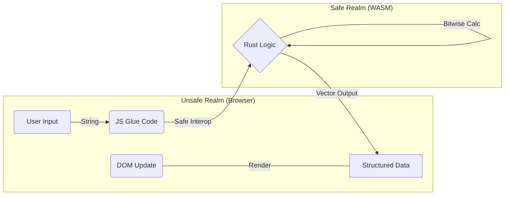

# Bitwise State Visualizer (Rust / WASM)


A high-performance systems utility for inspecting integer representation and bitwise state changes. Built on **Rust** and **WebAssembly**, this tool moves low-level radix transformation logic client-side, ensuring deterministic 1:1 conversion accuracy without server overhead.

---

## ⚡ Technical Capability
This project serves as a proof-of-concept for **Zero-Latency Logic Layers**. By compiling Rust to WASM, we achieve:
* **Memory Safety:** Leveraging Rust's ownership model to prevent overflow/underflow errors during integer conversion.
* **Native Performance:** Execution speeds near native C++ levels directly within the browser V8 engine.
* **Type-Safe Bridging:** Utilizing `wasm-bindgen` to create strict contract boundaries between the unstable JavaScript frontend and the rigid Rust backend.

---

## 🏗 Architecture

The application uses a "Headless Logic" pattern. The UI is dumb; the WASM binary is the authority.



## 🛠 Features

* **Radix Transmutation:** Real-time, bi-directional conversion between Decimal (Base-10) and Binary (Base-2) formats.
* **Visual Memory Layout:** Dynamic representation of bit states ($2^0 \dots 2^n$), mimicking register inspection tools.
* **Algorithm Visualization:** Exposes the underlying "Repeated Division" and "Summation" logic used in compiler integer parsing.
* **Input Sanitization:** Rust pattern matching handles invalid input states (NaN, Overflow) before they reach the render layer.

---

## 🚀 Engineering Workflow

### Prerequisites
* **Rust Toolchain:** Stable release.
* **Wasm-Pack:** The standard Rust-to-WASM compiler.

### Build Protocol

**1. Clone & Initialize**
```bash
git clone https://github.com/gammahazard/binary-visualizer.git
cd binary-visualizer
```

**2. Compile Target**
We target `web` to generate a direct ES-module compatible binary.
```bash
wasm-pack build --target web
```

**3. Local Interface**
Due to CORS policies on `.wasm` loading, a local server is required.
```bash
python3 -m http.server 8000
```

---

## 🌍 Deployment Strategy (Vercel)

This project is deployed as a static site, but requires specific handling of build artifacts.

* **Artifact Retention:** The `pkg/` directory (compiled WASM) is forcibly committed to Git (`git add -f pkg`) to bypass standard ignore rules, ensuring the production environment matches the local build exactly.

---

## 📂 System Structure

* `src/lib.rs` - **The Core:** Pure Rust implementation of the conversion algorithms.
* `pkg/` - **The Artifact:** The compiled binary and JS bindings.
* `index.html` - **The Surface:** A lightweight interface that strictly renders data provided by the WASM instance.

---
<div align="center">
  <sub>Developed by Vanguard Secure Solutions</sub>
</div>
